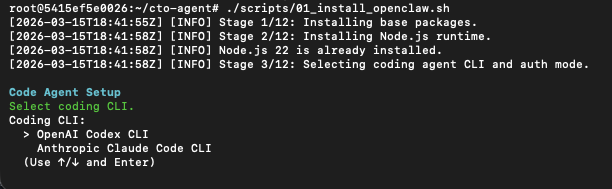
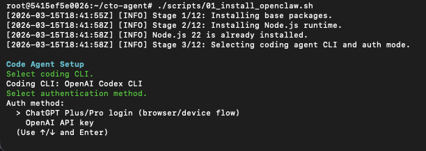
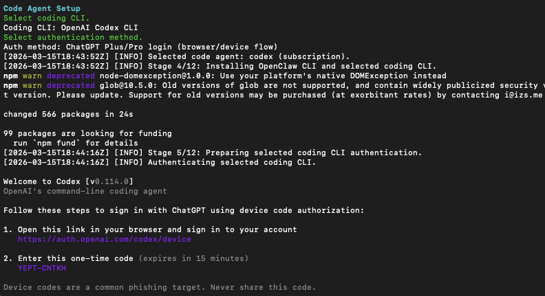
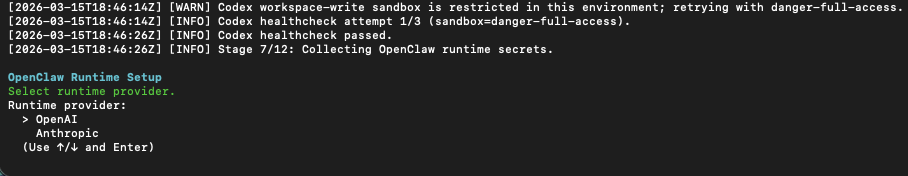
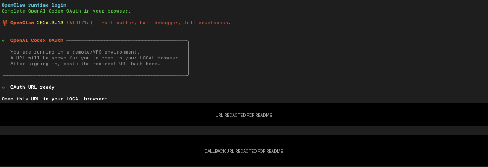
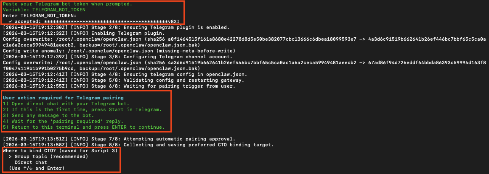
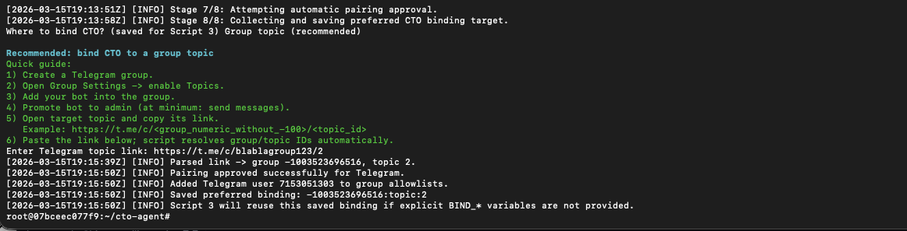
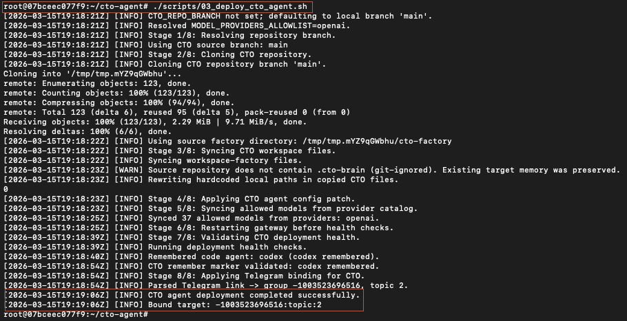

# CTO Bot Deployment (OpenClaw + Codex/Claude Code)

The core premise in one sentence: taking the CTO concept from theory to reality by deploying the automated state machine on your own server.

This repository installs OpenClaw and deploys the **CTO Factory Agent** (`cto-factory`). The walkthrough screenshots below use **OpenAI OAuth with a ChatGPT Plus/Pro subscription** as one concrete example path. The same scripts also support the other authentication paths listed below.

What the CTO bot is for:
- safer agent creation workflow
- controlled rollout with backup and rollback
- config validation before apply
- operational helper flows for OpenClaw

This deployment package supports:
- OpenAI and Anthropic runtime providers
- Codex CLI and Claude Code CLI as coding agents
- API key and subscription login flows
- direct-chat binding and Telegram group topic binding

## Open Source Governance

Before contributing, read:
- [LICENSE](LICENSE) (Apache-2.0)
- [CONTRIBUTING.md](CONTRIBUTING.md)
- [SECURITY.md](SECURITY.md)
- [CODE_OF_CONDUCT.md](CODE_OF_CONDUCT.md)
- [TRADEMARKS.md](TRADEMARKS.md)

Contribution model:
- DCO-based sign-off is required (`git commit -s`)
- pull requests are the only merge path to protected branches

## Quick V1 Note

This is a production-used V1, not a polished V2.

Known rough edge:
- sometimes the CTO may go silent in Telegram during a long run; if that happens, send a short ping message in the same chat/topic and it should resume reporting

If you hit other odd behavior, open an issue or post it in the community feed.

## Prerequisites

You need:
- Ubuntu 22.04 LTS or Ubuntu 24.04 LTS
- SSH access as user `ubuntu` with `sudo`
- a clean or controlled EC2/VPS host
- a Telegram bot token from BotFather
- credentials for **one** supported auth path

Tested heavily on:
- OpenClaw `2026.3.8`

Out of scope in this guide:
- EC2 provisioning
- SSH key setup

If needed, use AWS docs:
- <https://docs.aws.amazon.com/AWSEC2/latest/UserGuide/EC2_GetStarted.html>

## Choose 1 of 4 Authentication Paths

CTO supports exactly 4 auth paths. Pick one and follow it end-to-end.

| Path | Coding agent auth | OpenClaw runtime auth | Best for |
|---|---|---|---|
| 1. OpenAI OAuth subscription | Codex login | OpenAI Codex OAuth | ChatGPT Plus/Pro users |
| 2. Anthropic OAuth subscription | Claude `setup-token` | Anthropic `setup-token` | Claude subscription users |
| 3. OpenAI API key | Codex with API key | OpenAI with API key | pay-as-you-go OpenAI usage |
| 4. Anthropic API key | Claude Code with API key | Anthropic with API key | pay-as-you-go Anthropic usage |

What this README focuses on:
- the step-by-step screenshots below follow **Path 1: OpenAI OAuth subscription** as one example
- the scripts still support all 4 paths
- if you choose an API-key path and both the coding agent and the runtime use the same provider, Script `01` reuses that key automatically

## Deploy on a Clean Server

### 0) Create your Telegram bot token

In Telegram:
1. Open `@BotFather`
2. Run `/newbot`
3. Follow the naming steps
4. Copy the bot token

Optional reference guide:
- [OpenClaw Community Guide](https://www.skool.com/ai-agents-openclaw/classroom/2a105da6?md=4501a64424d045de97b98683c8181b8c)

### 1) Bootstrap dependencies and clone repo

Connect to your server over SSH and run:

```bash
curl -fsSL https://raw.githubusercontent.com/no-name-labs/cto/main/scripts/00_bootstrap_dependencies.sh | bash
```

What Script `00` does:
- installs base OS dependencies
- cleans stale NodeSource apt entries if needed
- clones this repository into `~/cto-agent`
- tries to switch you into `~/cto-agent`
- prints the next steps

If shell handoff is not available after `curl | bash`, run:

```bash
cd ~/cto-agent
```

If you are validating a different branch or a fork, override the bootstrap source explicitly:

```bash
curl -fsSL https://raw.githubusercontent.com/<owner>/<repo>/<ref>/scripts/00_bootstrap_dependencies.sh | \
  CTO_REPO_URL=https://github.com/<owner>/<repo>.git CTO_REPO_BRANCH=<ref> bash
```


### 2) Install OpenClaw and your coding agent

Run:

```bash
./scripts/01_install_openclaw.sh
```

Script `01` is the main installer wizard. It asks you:
- which coding agent to use (`Codex` or `Claude Code`)
- how that coding agent should authenticate
- which provider OpenClaw runtime should use (`OpenAI` or `Anthropic`)
- how the runtime should authenticate

One concrete walkthrough in this guide uses:
- `OpenAI Codex CLI`
- `ChatGPT Plus/Pro login`
- runtime provider: `OpenAI`
- runtime auth: `ChatGPT/Codex OAuth`

It also:
- installs Node.js, OpenClaw CLI, and the selected coding CLI
- authenticates the selected coding CLI
- validates the coding CLI with a healthcheck
- writes runtime files under `~/.openclaw`
- configures the OpenClaw runtime auth profile
- reuses the existing gateway token if present, otherwise generates one automatically

If this step appears stuck for more than 5 minutes during Node.js setup:
- press `ENTER` once in the same terminal
- some Ubuntu hosts pause on an interactive `needrestart` prompt

#### Example walkthrough: OpenAI OAuth subscription

1. Select `OpenAI Codex CLI` as the coding agent.



2. Select `ChatGPT Plus/Pro login`.
   If you choose the OpenAI API-key path instead, paste the OpenAI key once here. If the OpenClaw runtime also uses the OpenAI API-key path, Script `01` reuses that same key automatically.



3. Script `01` installs Codex CLI and prints a device-login URL plus a one-time code.
   Open that URL in the browser on your host machine, sign in, press `Continue`, enter the one-time code, and return to the terminal.
   Script `01` then validates Codex automatically and runs the coding-agent healthcheck.



4. For the OpenClaw runtime, select `OpenAI` as the runtime provider. Then continue with `ChatGPT/Codex OAuth` for the runtime auth.



5. OpenClaw prints a runtime OAuth URL.
   Open it in your local browser, sign in, and press `Continue`.
   On remote hosts, VPS machines, and containers the browser will usually end on a `localhost` page that says `This site can't be reached`.
   That is expected. Copy the full browser URL and paste it back into the terminal when OpenClaw asks for the redirect URL.



#### Other supported auth paths

The installer also supports:
- **Anthropic OAuth subscription**: choose `Anthropic Claude Code CLI` and follow the `claude setup-token` flow; if you also choose Anthropic for the runtime, you can reuse that token there
- **OpenAI API key**: paste `OPENAI_API_KEY` when prompted; if both coding agent and runtime use OpenAI API-key mode, Script `01` reuses it automatically
- **Anthropic API key**: paste `ANTHROPIC_API_KEY` when prompted; if both coding agent and runtime use Anthropic API-key mode, Script `01` reuses it automatically

### 3) Connect Telegram and approve pairing

Run:

```bash
./scripts/02_setup_telegram_pairing.sh
```

Script `02` asks for:
- `TELEGRAM_BOT_TOKEN`
- where CTO should be bound:
  - **Group topic (recommended)** if you are building agents seriously
  - **Direct chat** if you only want a local playground or quick experiments

Why topic binding is recommended:
- it gives you a stable control room for your team
- later the CTO can create and bind other agents into topics from the same environment
- you only need to copy the Telegram topic link and paste it into the terminal

What Script `02` does:
- enables the Telegram plugin
- writes the Telegram token into config
- restarts gateway
- waits for the pairing trigger
- auto-approves pairing
- stores the preferred CTO binding so Script `03` can reuse it automatically

When the script pauses for pairing:
1. Open a direct chat with your Telegram bot
2. If this is the first time, press `Start`
3. Send any message to the bot
4. Wait for the `pairing required` reply
5. Return to the terminal and press `ENTER`

The first Script `02` screen covers three things in one flow:
- paste the Telegram bot token
- trigger pairing from direct chat with the bot
- choose where CTO should be bound after pairing completes



If you choose `Group topic (recommended)`, Script `02` prints a short guide and asks for the Telegram topic link.
Just copy the topic URL from Telegram and paste it into the terminal. Script `02` resolves the group/topic IDs and saves that binding for Script `03`.



### 4) Deploy your CTO agent

Run:

```bash
./scripts/03_deploy_cto_agent.sh
```

Script `03` normally does not ask for new input.
It uses the state already collected by Scripts `01` and `02`, then:
- syncs the `cto-factory` workspace
- patches the agent config
- validates the remembered coding agent
- applies the saved Telegram binding automatically

Success signals:
- `Remembered code agent: ...`
- `CTO remember marker validated: ...`
- `Bound target: ...`



## Verify Deployment

Run on the server:

```bash
openclaw --version
if command -v codex >/dev/null 2>&1; then codex --version; fi
if command -v claude >/dev/null 2>&1; then claude --version; fi
openclaw config validate --json
openclaw health --json
```

Local CTO smoke:

```bash
openclaw agent --local --agent cto-factory --message "Reply with CTO_FACTORY_OK" --json
```

## Your First Task

Open your Telegram bot and send a simple test message.

Prompt example:

```text
Create a new Reddit monitoring agent for OpenClaw topics.
It should monitor selected subreddits via RSS and post updates to Telegram.
Start with your intake survey, collect missing decisions, then run your normal build pipeline and stop at READY_FOR_APPLY.
```

What to expect:
- CTO should stop and ask for missing requirements first
- then it should delegate coding to the remembered code agent
- then it should run tests and validation
- then it should stop at `READY_FOR_APPLY` instead of blindly mutating production

## Example Workflow: CTO Builds and Fixes a Real Agent

This is the fastest way to understand how the CTO bot is meant to be used in practice. The example below shows one real loop end-to-end: requirements intake, Codex-backed build, a failed smoke test, an in-place fix, a successful retest, an apply action, and final Telegram output.

### 1) Start with the outcome, not with implementation details

Ask for the agent you want. The CTO bot should stop and run intake before coding.


### 2) Expect build evidence, not just a success claim

The CTO bot should show Codex delegation, generated workspace/files, test execution, and config validation before it says `READY_FOR_APPLY`.


### 3) Force a live smoke test

A good CTO agent does not stop at green unit tests. It should run a real smoke test against the actual delivery path and report the exact failure if something breaks.


### 4) Fix the existing agent in place

You do not need to rebuild from scratch. Here the CTO bot was told to fix the existing Reddit agent, keep behavior intact, rerun tests, and validate config before apply.


### 5) Retest and prove delivery

After the fix, the bot was re-tested and returned delivery evidence with `sent: true` and no fallback, then it was asked to run the agent immediately.


### 6) Apply after verification

Once the change is verified, you can ask the CTO bot to apply it. In this case it dispatched a gateway restart callback so the updated production binding would be loaded.


### 7) Final result in Telegram

The finished agent posts raw Reddit items first, then adds a concise summary for that run.


What this example demonstrates:
- the CTO bot should ask questions before coding when requirements are incomplete
- code changes should be routed through the remembered code agent, not hand-written inline by the manager agent
- every meaningful change should be backed by tests and `openclaw config validate --json`
- a real smoke test matters more than a green unit test when Telegram delivery is part of the workflow
- you can iterate on the same agent safely by tightening prompts and forcing another test cycle

## Update CTO Agent (Existing Install)

When new CTO changes are released, run:

```bash
cd ~/cto-agent
./scripts/05_update_cto_agent.sh
```

What Script `05` does:
- updates this repository to latest `main` by default
- creates rollback backup under `~/.openclaw/backups/cto-update-<timestamp>`
- syncs updated `cto-factory` files into `~/.openclaw/workspace-factory`
- validates `openclaw.json`
- restarts gateway and runs CTO smoke check

Useful options:
- `UPDATE_REPO=false` to skip git pull and use local repo state
- `CTO_REPO_REF=<tag-or-branch>` to pin the update source
- `SKIP_CTO_HEALTH_SMOKE=true` to skip the local agent smoke
- `RESTART_GATEWAY=false` to update files and config without restart

## BETA Notes (Existing OpenClaw Installation)

> BETA: the scripts are designed to be additive, but this is not zero-risk for a busy multi-agent host.

Recommended before deployment:

```bash
cp ~/.openclaw/openclaw.json ~/.openclaw/openclaw.json.manual-backup.$(date +%Y%m%d-%H%M%S)
```

Known side effects in existing installs:
- gateway restarts can interrupt active runs
- global Telegram policy fields can be updated for CTO routing
- tool-level global settings may be updated (`tools.sessions.visibility`, `tools.agentToAgent`)

Use a maintenance window for production systems.

## Uninstall / Rollback Script

To remove OpenClaw/CTO stack from the host:

```bash
./scripts/99_uninstall_openclaw.sh
```

Options:
- `REMOVE_REPO=true` to also delete `~/cto-agent`
- `WIPE_NODE_STACK=true` (default) to remove Node/OpenClaw/Codex binaries

## Optional Features

These features work out of the box without any additional setup. API keys unlock deeper capability where noted.

### Web research during planning

The CTO bot searches the web before presenting an implementation plan for non-trivial tasks. This gives it real documentation and current best practices instead of relying only on model memory.

**How it works by default (no setup required):**
CTO uses DuckDuckGo via `curl` + `web_fetch` to pull 3–20 sources depending on task complexity. Results are cached in `.cto-brain/research/` and referenced throughout the session.

**Enhanced search with Brave Search API (optional):**
For higher-quality results and more reliable search, add a Brave Search API key:

1. Sign up at [brave.com/search/api](https://brave.com/search/api/) — free tier includes 2 000 queries/month
2. On your server, run:
   ```bash
   openclaw secrets set BRAVE_API_KEY <your-key>
   ```
3. No restart needed. CTO will automatically use Brave Search instead of the curl fallback.

## Security Notes

- do not commit `.env`, tokens, or auth profiles
- review gateway-restart behavior before running on production traffic
- prefer topic isolation for production-facing agents

## Runtime User Model

Current behavior in this repo:
- OpenClaw runs as the same Linux user that runs the scripts, usually `ubuntu` on EC2
- the default home is `~/.openclaw`, so runtime state, auth profiles, and logs stay under that user
- gateway is configured for loopback + token auth by default

What that means operationally:
- this is acceptable for a single-tenant dev VM or an internal admin box
- the `ubuntu` account becomes part of your trust boundary
- any compromise of that account exposes OpenClaw state and secrets under `~/.openclaw`

If you need stronger isolation, use a hardened service account or container boundary on top of this deployment pack.
