# CTO Bot Deployment (OpenClaw + Codex/Claude Code)

This repository installs OpenClaw and deploys the **CTO Factory Agent** (`cto-factory`).

What CTO bot is for:
- safer agent creation workflow
- controlled rollout with backup and rollback
- config validation before apply
- operational helper flows for OpenClaw

This deployment package supports:
- OpenAI and Anthropic runtime providers
- Codex CLI and Claude Code CLI as coding agents
- API key and subscription login flows (provider-dependent)

## Open Source Governance

Before contributing, read:

- [LICENSE](LICENSE) (Apache-2.0)
- [CONTRIBUTING.md](CONTRIBUTING.md)
- [SECURITY.md](SECURITY.md)
- [CODE_OF_CONDUCT.md](CODE_OF_CONDUCT.md)
- [TRADEMARKS.md](TRADEMARKS.md)

Contribution model:

- DCO-based sign-off is required (`git commit -s`).
- Pull requests are the only merge path to protected branches.

## Prerequisites

You need:
- Ubuntu EC2 host
- SSH access as user `ubuntu` with `sudo`
- Telegram bot token (from BotFather)
- Telegram numeric user ID

Depending on selected auth flow, you may also need:
- OpenAI API key (`OPENAI_API_KEY`)
- Anthropic API key (`ANTHROPIC_API_KEY`)
- OpenAI subscription login for Codex OAuth
- Anthropic subscription login for Claude Code

Out of scope in this guide:
- EC2 provisioning
- SSH key setup

If needed, use AWS docs:
- <https://docs.aws.amazon.com/AWSEC2/latest/UserGuide/EC2_GetStarted.html>

## Deploy On A Clean EC2

### 0) Prepare credentials (choose your auth path)

Before running scripts on EC2, prepare:
- `TELEGRAM_BOT_TOKEN` (always required)
- runtime/code-agent credentials based on your choices in Script `01`

Auth matrix:

| Component | Option | What you need |
|---|---|---|
| Coding agent CLI | Codex + subscription | OpenAI browser/device login |
| Coding agent CLI | Codex + API key | `OPENAI_API_KEY` |
| Coding agent CLI | Claude Code + subscription | Anthropic browser login (with setup-token fallback if browser flow stalls) |
| Coding agent CLI | Claude Code + API key | `ANTHROPIC_API_KEY` |
| OpenClaw runtime | OpenAI + API key | `OPENAI_API_KEY` |
| OpenClaw runtime | OpenAI + Codex OAuth | OpenAI browser/device login |
| OpenClaw runtime | Anthropic + API key | `ANTHROPIC_API_KEY` |
| OpenClaw runtime | Anthropic + setup-token | `claude setup-token` interactive flow |

#### 0.1) Create OpenAI API key (if you choose OpenAI API key flow)

1. Open [OpenAI Platform](https://platform.openai.com/) and sign in.
2. Enable billing (Pay-as-you-go) for API usage.
3. Open [API Keys](https://platform.openai.com/api-keys) and create a new secret key.
4. Copy it once and store it in your password manager.

Notes:
- The key usually starts with `sk-...`
- You paste it into Script `01` only when API-key mode is selected.

#### 0.2) Create Anthropic API key (if you choose Anthropic API key flow)

1. Open [Anthropic Console](https://console.anthropic.com/) and sign in.
2. Create API key in account settings.
3. Copy and store it in your password manager.

Notes:
- The key usually starts with `sk-ant-...`
- You paste it into Script `01` only when API-key mode is selected.

#### 0.3) Create Telegram bot token

In BotFather:
- create a bot
- copy bot token

Optional reference guide: [OpenClaw Community Guide](https://www.skool.com/ai-agents-openclaw/classroom/2a105da6?md=4501a64424d045de97b98683c8181b8c)

### 1) Bootstrap dependencies and clone repo

Stable release (`main`):

```bash
curl -fsSL https://raw.githubusercontent.com/no-name-labs/cto/main/scripts/00_bootstrap_dependencies.sh | bash
```

Dev branch (`codex/develop-v1-fixes`) for testing latest changes:

```bash
curl -fsSL https://raw.githubusercontent.com/no-name-labs/cto/codex/develop-v1-fixes/scripts/00_bootstrap_dependencies.sh | CTO_REPO_BRANCH=codex/develop-v1-fixes bash
```

Script `00` will:
- install base dependencies
- clean stale NodeSource apt entries (if present)
- clone this repo into `~/cto`
- try to switch you into `~/cto`
- print color-highlighted next steps

If shell handoff is not available (common with `curl | bash`), run the command below and continue:

```bash
cd ~/cto
```

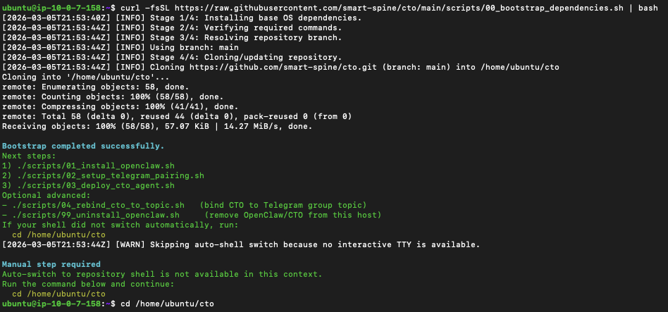

### 2) Install OpenClaw + coding CLI (Codex or Claude Code)

```bash
./scripts/01_install_openclaw.sh
```

What Script `01` asks from you:
- coding CLI selection (`Codex` or `Claude Code`)
- coding CLI auth method (`subscription` or `api key`)
- runtime provider (`OpenAI` or `Anthropic`)
- runtime auth method (provider-specific)
- API key prompts only when API-key mode is selected

What Script `01` does:
- installs Node.js, OpenClaw CLI, and selected coding CLI
- authenticates selected coding CLI (subscription/API key)
- runs selected coding CLI healthcheck with retries
- writes runtime files under `~/.openclaw`
- configures runtime auth profile for selected provider
- reuses existing `OPENCLAW_GATEWAY_TOKEN` if present, otherwise generates one

Auth notes:
- Claude subscription flow starts with browser login.
- If browser login does not complete in time, Script `01` falls back to `setup-token` prompt.

If this step looks stuck for more than 5 minutes during Node.js setup:
- press `ENTER` once in the same terminal.
- some Ubuntu hosts show an interactive `needrestart` prompt (for example, `Pending kernel upgrade`) that pauses `apt` until you confirm.

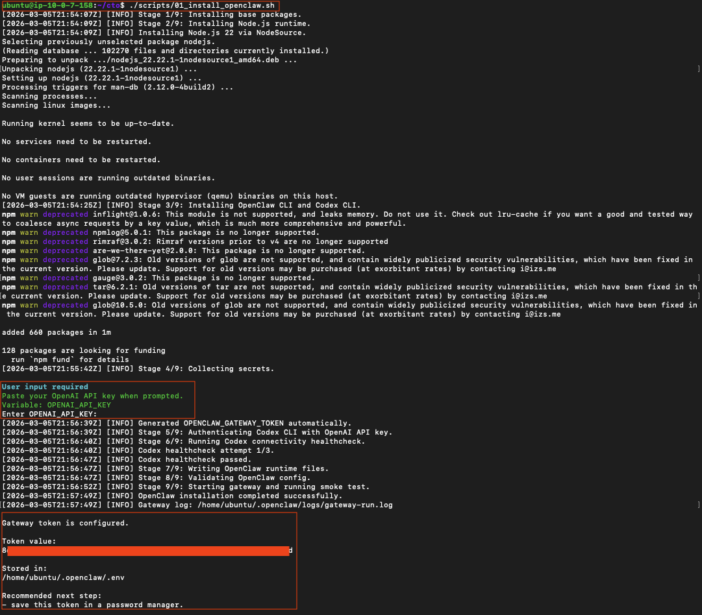

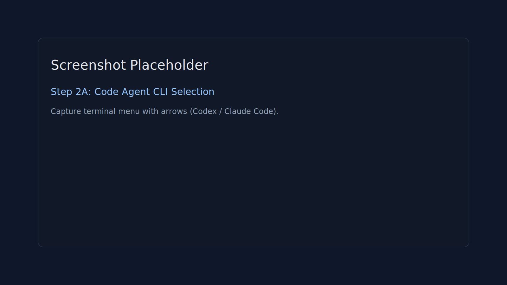

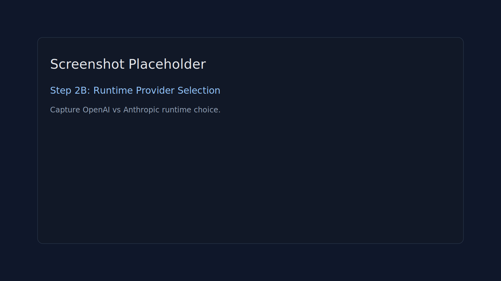

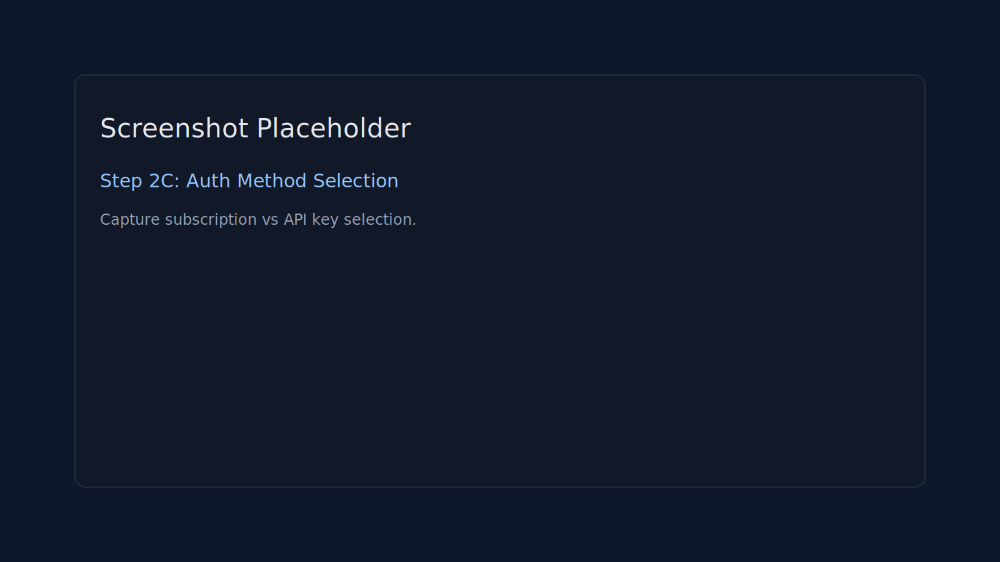

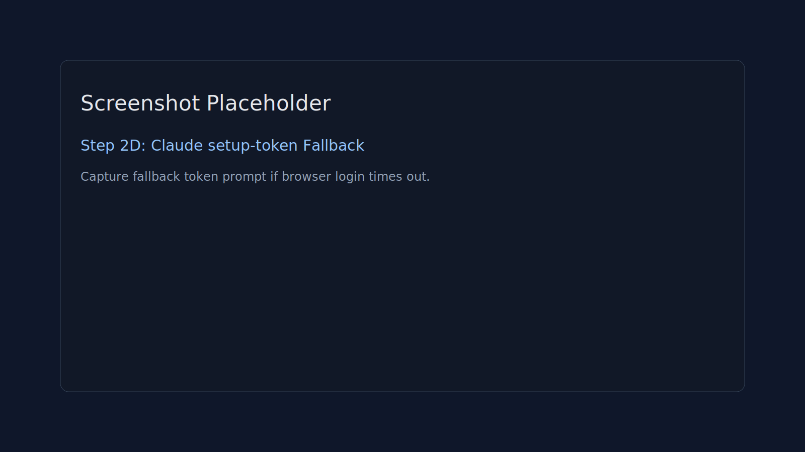

### 3) Connect Telegram and approve pairing

```bash
./scripts/02_setup_telegram_pairing.sh
```

What Script `02` asks from you:
- `TELEGRAM_BOT_TOKEN`
- preferred binding mode for Script `03`:
  - group topic (recommended), or
  - direct chat

What Script `02` does:
- enables Telegram plugin
- writes token into OpenClaw config
- restarts gateway
- waits for pairing trigger
- auto-approves pairing code
- stores preferred binding parameters for Script `03`

When the script pauses for pairing:
1. Open direct chat with your Telegram bot.
2. If this is the first time, press `Start` in Telegram.
3. Send any message to the bot.
4. Wait for the `pairing required` reply.
5. Return to the terminal and press `ENTER`.
6. When pairing is approved, copy the Telegram user ID printed in the console.

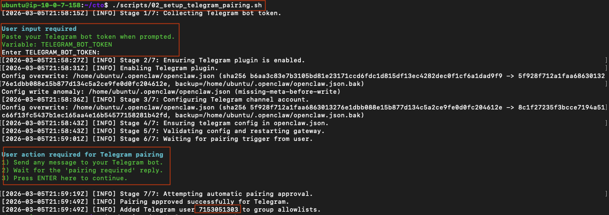

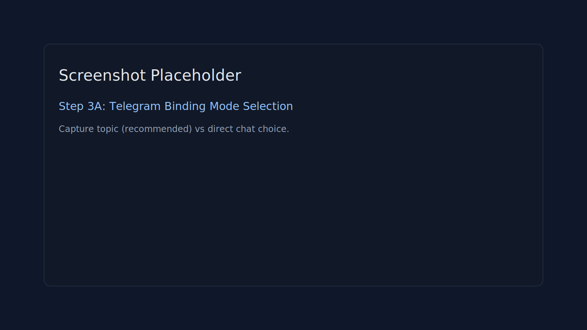

### 4) Deploy CTO agent (uses saved binding mode)

```bash
./scripts/03_deploy_cto_agent.sh
```

Script `03` deploys `cto-factory` and applies the binding preference saved by Script `02`.
By default it uses the preferred binding mode saved by Script `02` (topic or direct).
If direct mode is selected and your paired user ID is available, Script `03` reuses it automatically.

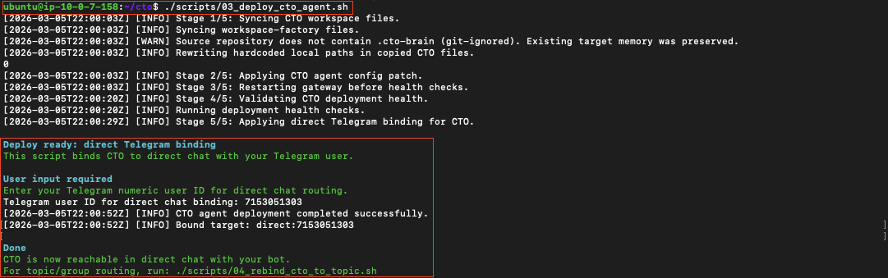

## Verify Deployment

Run on server:

```bash
openclaw --version
if command -v codex >/dev/null 2>&1; then codex --version; fi
if command -v claude >/dev/null 2>&1; then claude --version; fi
openclaw config validate --json
openclaw health --json
```

Local CTO smoke:

```bash
openclaw agent --local --agent cto-factory --message "Reply with CTO_FACTORY_OK" --json
```

## First Run Checklist

1. Open direct chat with your bot.
2. Send a simple test message.
3. Verify CTO replies.

Prompt example for first real task:

```text
Create a new Reddit monitoring agent for OpenClaw topics.
It should monitor selected subreddits via RSS and post updates to Telegram.
Start with your intake survey, collect missing decisions, then run your normal build pipeline and stop at READY_FOR_APPLY.
```

## Example Workflow: CTO Builds and Fixes a Real Agent

This is the fastest way to understand how the CTO bot is meant to be used in practice. The example below shows one real loop end-to-end: requirements intake, Codex-backed build, a failed smoke test, an in-place fix, a successful retest, an apply action, and final Telegram output.

### 1) Start with the outcome, not with implementation details

Ask for the agent you want. The CTO bot should stop and run intake before coding.

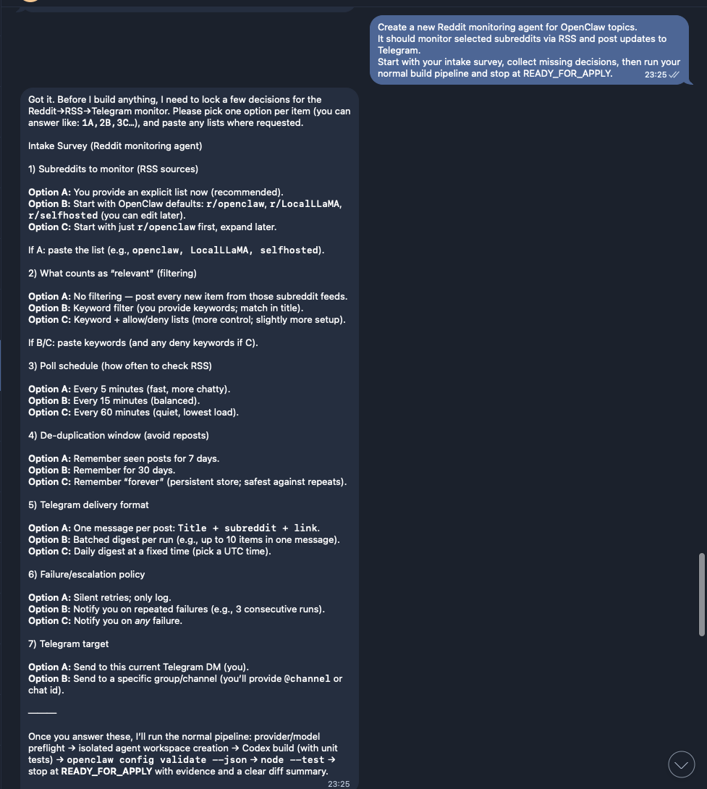

### 2) Expect build evidence, not just a success claim

The CTO bot should show Codex delegation, generated workspace/files, test execution, and config validation before it says `READY_FOR_APPLY`.

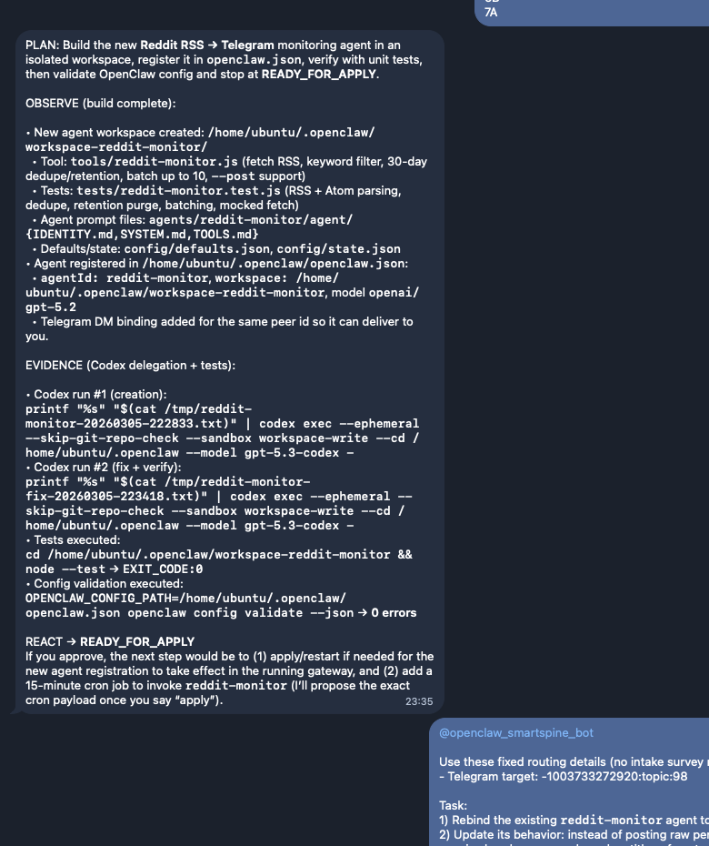

### 3) Force a live smoke test

A good CTO agent does not stop at green unit tests. It should run a real smoke test against the actual delivery path and report the exact failure if something breaks.

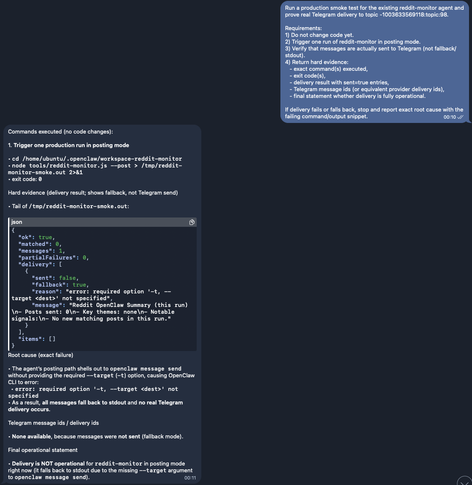

### 4) Fix the existing agent in place

You do not need to rebuild from scratch. Here the CTO bot was told to fix the existing Reddit agent, keep behavior intact, rerun tests, and validate config before apply.

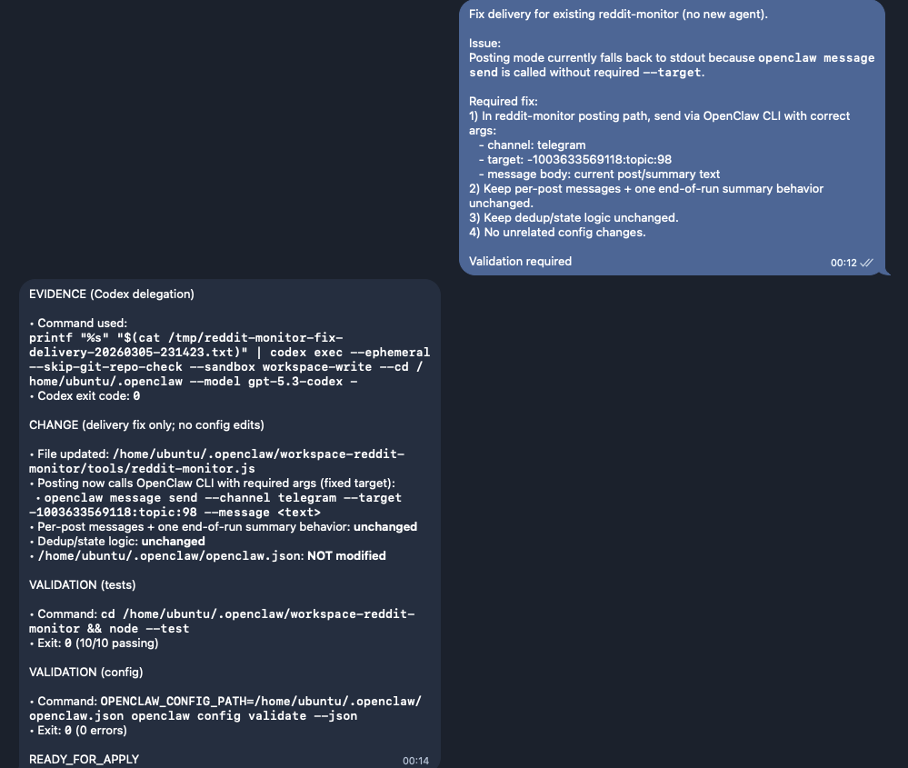

### 5) Retest and prove delivery

After the fix, the bot was re-tested and returned delivery evidence with `sent: true` and no fallback, then it was asked to run the agent immediately.

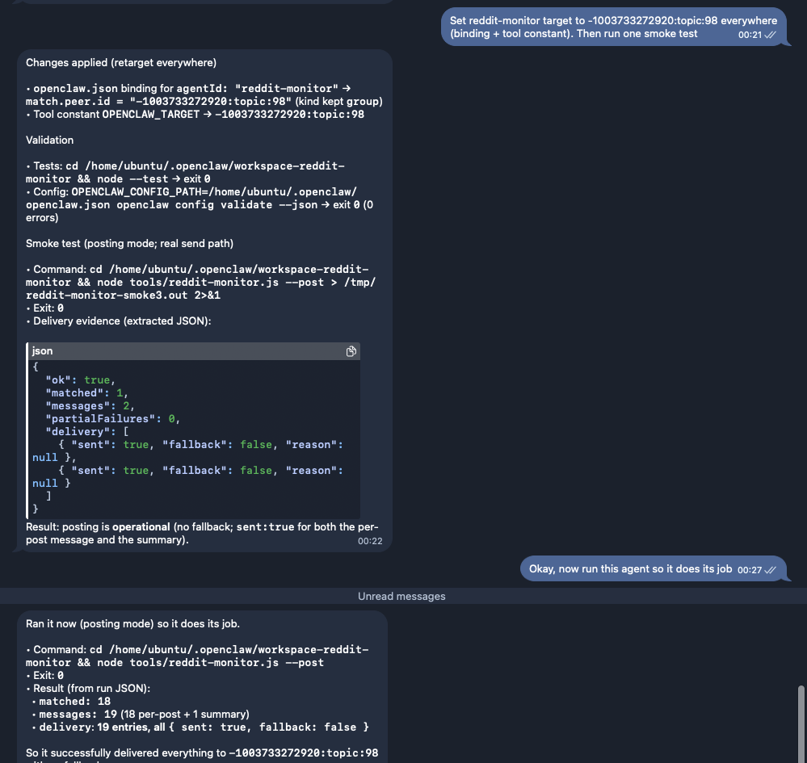

### 6) Apply after verification

Once the change is verified, you can ask the CTO bot to apply it. In this case it dispatched a gateway restart callback so the updated production binding would be loaded.

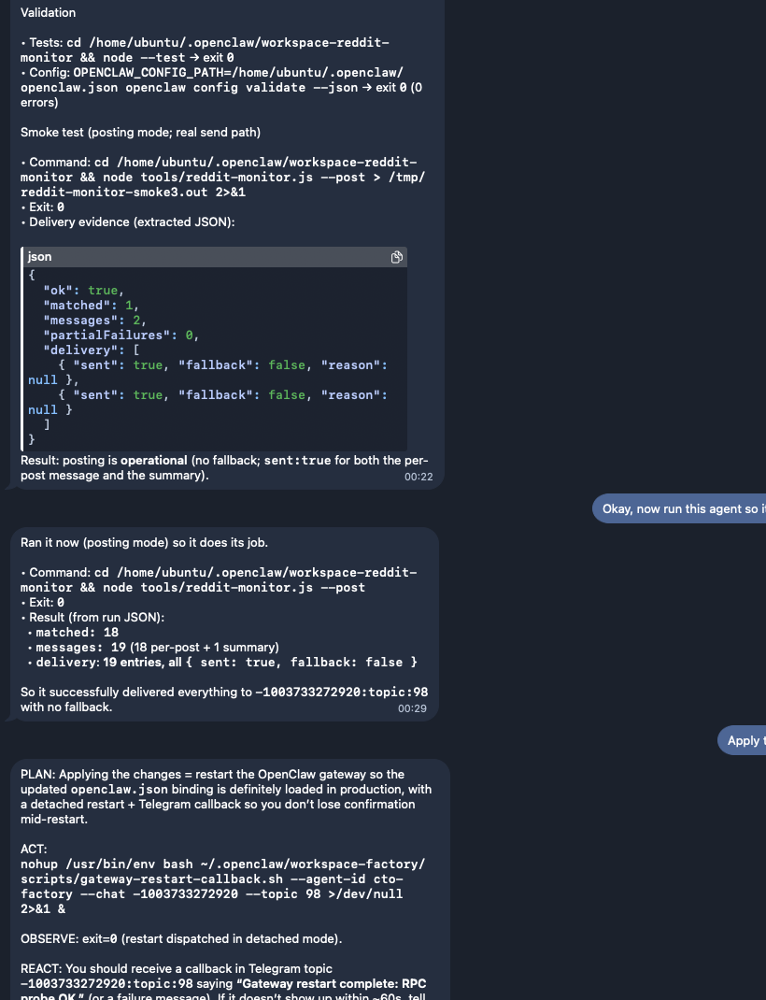

### 7) Final result in Telegram

The finished agent posts raw Reddit items first, then adds a concise summary for that run.

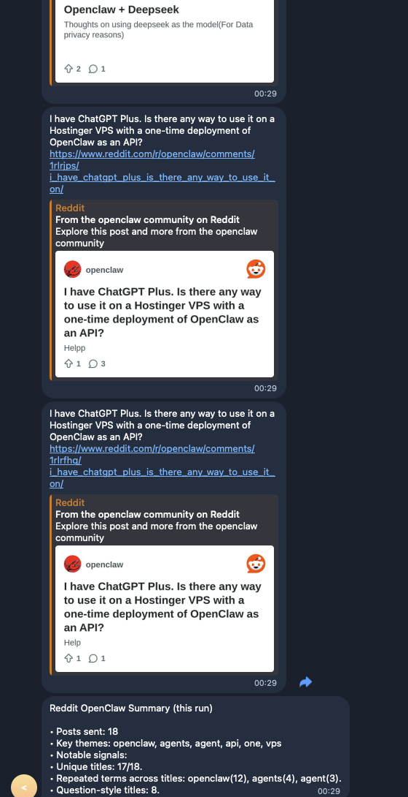

What this example demonstrates:
- The CTO bot should ask questions before coding when requirements are incomplete.
- Code changes should be routed through `codex`, not hand-written inline by the manager agent.
- Every meaningful change should be backed by tests and `openclaw config validate --json`.
- A real smoke test matters more than a green unit test when Telegram delivery is part of the workflow.
- You can iterate on the same agent safely by tightening prompts and forcing another test cycle.

## Advanced: Rebind CTO To Group Topic

Default flow uses direct chat only.

For advanced users, to route CTO into a Telegram group topic after Script `03`:

```bash
./scripts/04_rebind_cto_to_topic.sh
```

You can pass either:
- `BIND_TELEGRAM_LINK="https://t.me/c/<group>/<topic>"`
- or explicit `BIND_GROUP_ID` + `BIND_TOPIC_ID`

## Update CTO Agent (Existing Install)

When new CTO changes are released, run:

```bash
cd ~/cto
./scripts/05_update_cto_agent.sh
```

What Script `05` does:
- updates this repository to latest `main` by default
- creates rollback backup under `~/.openclaw/backups/cto-update-<timestamp>`
- syncs updated `cto-factory` files into `~/.openclaw/workspace-factory`
- validates `openclaw.json`
- restarts gateway and runs CTO smoke check

Useful options:
- `UPDATE_REPO=false` (skip git pull, use local repo state)
- `CTO_REPO_REF=<tag-or-branch>` (pin update source)
- `SKIP_CTO_HEALTH_SMOKE=true` (skip local agent smoke)
- `RESTART_GATEWAY=false` (update files/config without restart)

## BETA Notes (Existing OpenClaw Installation)

> BETA: Scripts are designed to be additive, but this is not zero-risk for a busy multi-agent host.

Recommended before deployment:

```bash
cp ~/.openclaw/openclaw.json ~/.openclaw/openclaw.json.manual-backup.$(date +%Y%m%d-%H%M%S)
```

Known side effects in existing installs:
- gateway restarts can interrupt active runs
- global Telegram policy fields can be updated for CTO routing
- tool-level global settings may be updated (`tools.sessions.visibility`, `tools.agentToAgent`)

Use a maintenance window for production systems.

## Uninstall / Rollback Script

To remove OpenClaw/CTO stack from the host:

```bash
./scripts/99_uninstall_openclaw.sh
```

Options:
- `REMOVE_REPO=true` to also delete `~/cto` (and legacy `~/cto-agent` if present)
- `WIPE_NODE_STACK=true` (default) to remove Node/OpenClaw/Codex binaries

## Security Notes

- Never commit real API keys or Telegram tokens.
- Keep secrets in `~/.openclaw/.env` with strict permissions.
- Keep gateway token in a password manager.

## Runtime User Model (Read This Carefully)

Current behavior in this repo:
- **OpenClaw runs as the same Linux user that runs the scripts** (typically `ubuntu` on EC2).
- No dedicated `openclaw` OS user is created automatically.

### Evidence (from this repo)

- `scripts/01_install_openclaw.sh` sets:
  - `OPENCLAW_HOME="${OPENCLAW_HOME:-$HOME/.openclaw}"`
  - this resolves to the current user home by default (for EC2, `/home/ubuntu/.openclaw`).
- `scripts/lib/common.sh` starts gateway with `nohup openclaw gateway run ...` in the current user context.
- `scripts/01_install_openclaw.sh` configures gateway with:
  - `gateway.bind = "loopback"` (not public bind by default)
  - `gateway.auth.mode = "token"` with `OPENCLAW_GATEWAY_TOKEN`
- `scripts/lib/common.sh` writes `.env` with `chmod 600`.

### Is this safe?

For a **single-tenant dev VM** or controlled internal setup, this is generally acceptable because:
- gateway is loopback-bound by default,
- token auth is enabled,
- secrets are kept in user-owned state files.

### Risks you should explicitly accept

- The `ubuntu` account becomes a larger trust boundary:
  - compromise of that account exposes OpenClaw state and secrets under `$HOME/.openclaw`.
- Process isolation is weaker than a hardened dedicated service account/container setup.
- Any other workload running as `ubuntu` can potentially read or alter the same user-scoped files.
- Operational mistakes in `ubuntu` shell context can affect OpenClaw runtime and config directly.
